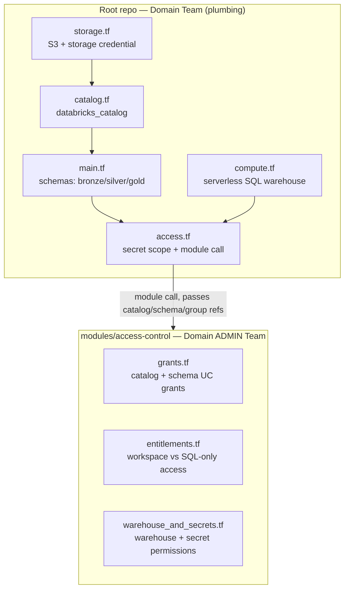
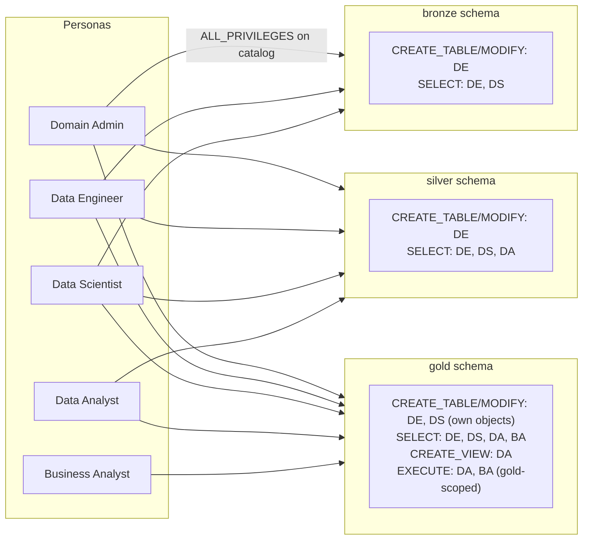
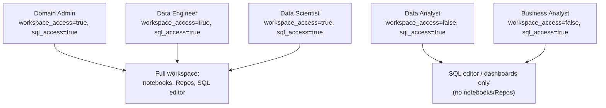
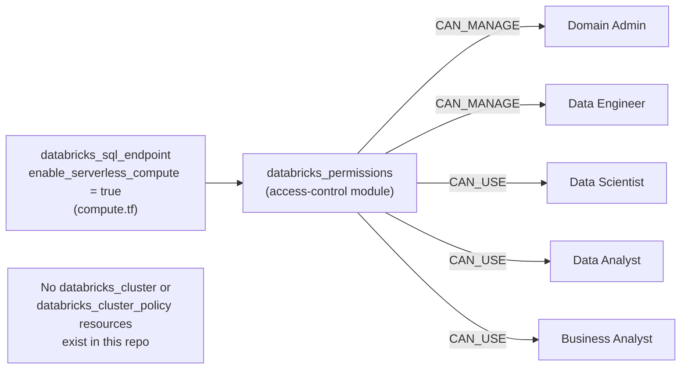
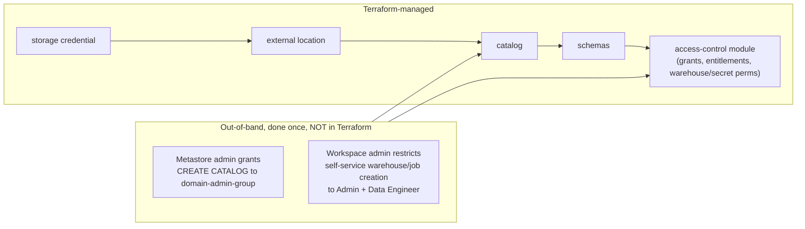
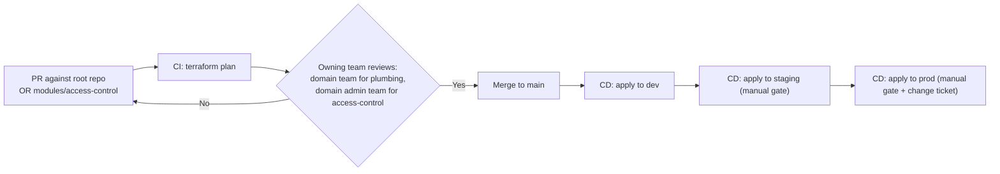

# Diagrams

## 1. Repo structure and module boundary

## 2. Persona access flow (5 personas, medallion layers)

## 3. Entitlements — workspace vs. SQL-only access

## 4. Serverless-only compute

## 5. One-time out-of-band steps vs. Terraform-managed

## 6. CI/CD pipeline

