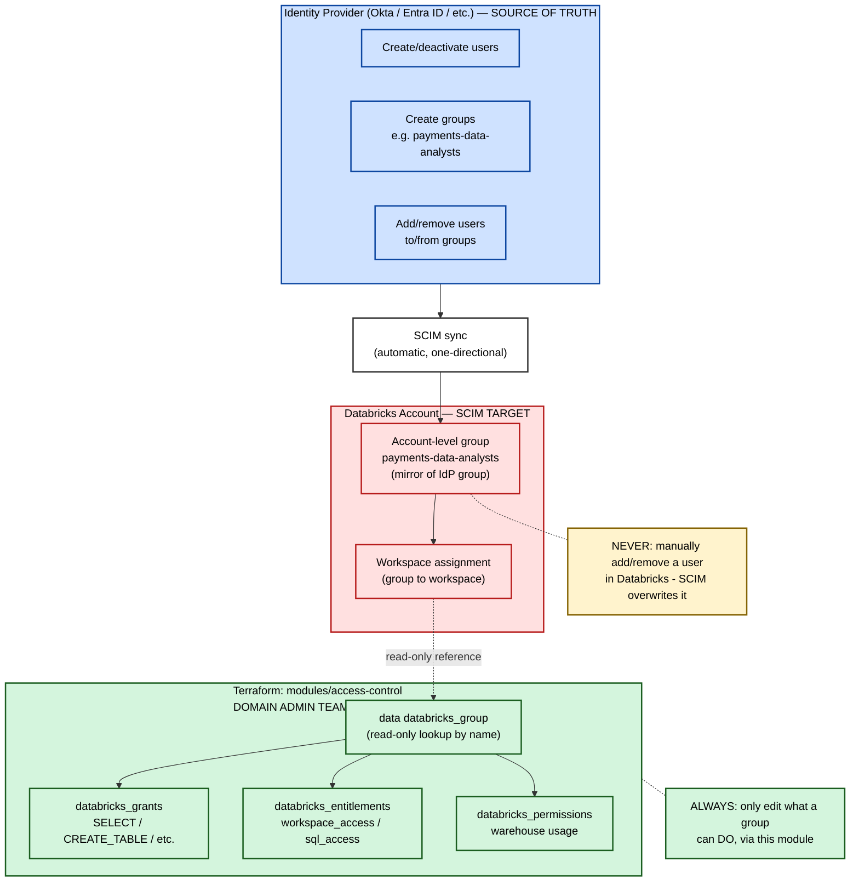

```mermaid
flowchart TB
    subgraph IDP["Identity Provider (Okta / Entra ID / etc.) — SOURCE OF TRUTH"]
        USER["Create/deactivate users"]
        GROUP["Create groups<br/>e.g. payments-data-analysts"]
        MEMBER["Add/remove users<br/>to/from groups"]
    end

    SCIM["SCIM sync<br/>(automatic, one-directional)"]

    IDP --> SCIM

    subgraph DBX["Databricks Account — SCIM TARGET"]
        ACCTGROUP["Account-level group<br/>payments-data-analysts<br/>(mirror of IdP group)"]
        WSASSIGN["Workspace assignment<br/>(group to workspace)"]
        ACCTGROUP --> WSASSIGN
    end

    SCIM --> ACCTGROUP

    subgraph TF["Terraform: modules/access-control<br/>DOMAIN ADMIN TEAM OWNS THIS"]
        LOOKUP["data databricks_group<br/>(read-only lookup by name)"]
        GRANTS["databricks_grants<br/>SELECT / CREATE_TABLE / etc."]
        ENT["databricks_entitlements<br/>workspace_access / sql_access"]
        WHPERM["databricks_permissions<br/>warehouse usage"]
        LOOKUP --> GRANTS
        LOOKUP --> ENT
        LOOKUP --> WHPERM
    end

    WSASSIGN -.->|"read-only reference"| LOOKUP

    NOTE1["NEVER: manually add/remove a user<br/>in Databricks - SCIM overwrites it"]
    NOTE2["ALWAYS: only edit what a group<br/>can DO, via this module"]

    ACCTGROUP -.- NOTE1
    TF -.- NOTE2

    classDef idpStyle fill:#cfe2ff,stroke:#0d47a1,stroke-width:2px,color:#000000
    classDef dbxStyle fill:#ffe0e0,stroke:#b71c1c,stroke-width:2px,color:#000000
    classDef tfStyle fill:#d4f5dd,stroke:#1b5e20,stroke-width:2px,color:#000000
    classDef noteBad fill:#fff3cd,stroke:#856404,stroke-width:2px,color:#000000
    classDef noteGood fill:#d4f5dd,stroke:#1b5e20,stroke-width:2px,color:#000000
    classDef scimStyle fill:#ffffff,stroke:#333333,stroke-width:2px,color:#000000

    class IDP,USER,GROUP,MEMBER idpStyle
    class DBX,ACCTGROUP,WSASSIGN dbxStyle
    class TF,LOOKUP,GRANTS,ENT,WHPERM tfStyle
    class SCIM scimStyle
    class NOTE1 noteBad
    class NOTE2 noteGood
```
