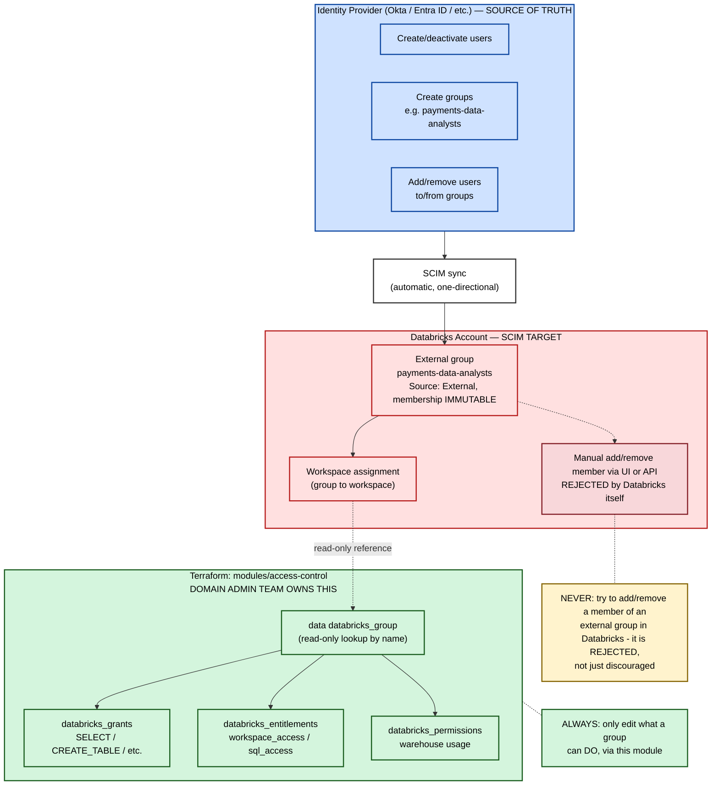

# User Access Management — Responsibility Matrix & Flow

## Responsibility matrix

| Activity | Central Identity Team | Domain Admin Team | Where it lives |
|---|---|---|---|
| Create/deactivate a user account | ✅ Owns | ❌ No access | IdP (Okta/Entra ID) |
| Create a new **external** (SCIM-synced) persona group | ✅ Owns | 🔶 Requests it | IdP, self-service or ticketed |
| Create a **local** group directly in Databricks | 🔶 Technically possible | 🔶 Technically possible, but discouraged | Databricks UI — creates identity sprawl outside SSO, not recommended when SCIM is in use |
| Add/remove a user from an **external** group | ✅ Owns | ❌ **Blocked by Databricks itself** | IdP only — UI/API attempts fail with an explicit error; external group membership is immutable by default |
| Sync groups/users into Databricks account | ✅ Owns (automatic) | ❌ No access | SCIM (one-directional) |
| Assign an account-level group to a workspace | 🔶 Usually owns | 🔶 Sometimes delegated (workspace admins can do this if identity federation is enabled) | Databricks account console / workspace admin settings / `databricks_mws_permission_assignment` |
| Turn off "Immutable external groups" protection | ✅ Account admin only | ❌ No access | Databricks account console preview settings — rarely recommended to disable |
| Grant catalog/schema privileges (SELECT, CREATE_TABLE, etc.) | ❌ No access | ✅ Owns | `modules/access-control/grants.tf` |
| Set entitlements (full workspace vs. SQL-editor-only) | ❌ No access | ✅ Owns | `modules/access-control/entitlements.tf` |
| Set warehouse usage permissions (CAN_USE / CAN_MANAGE) | ❌ No access | ✅ Owns | `modules/access-control/warehouse_and_secrets.tf` |
| Set secret scope ACLs | ❌ No access | ✅ Owns | `modules/access-control/warehouse_and_secrets.tf` |
| Create/drop the catalog itself | 🔶 Grants one-time `CREATE CATALOG` privilege | ✅ Owns (day-to-day) | `catalog.tf` |
| Workspace admin console, audit logs, billing, network/IP allow-lists | ✅ Owns | ❌ No access | Central, out of Terraform scope entirely |

**Legend:** ✅ full ownership · 🔶 shared, conditional, or technically-possible-but-discouraged · ❌ no access

**Rule of thumb:** Central Identity Team controls *who exists and which groups they belong to*, enforced by Databricks itself once a group is SCIM-synced — it's not just a policy, membership edits are actually rejected. Domain Admin Team controls *what each group is allowed to do*, entirely inside `modules/access-control`. Nothing in that module creates, deletes, or edits a user or group; every reference is a read-only lookup by group name.

---

## Flow diagram

## Key takeaway

Databricks doesn't just recommend keeping identity in the IdP — for any group synced via SCIM, it actively **rejects** membership edits attempted anywhere else (UI, account console, or the SCIM API itself), returning an explicit error. The domain admin team's real, enforced scope is everything downstream of "the group exists": grants, entitlements, and warehouse/secret permissions in `modules/access-control`.
